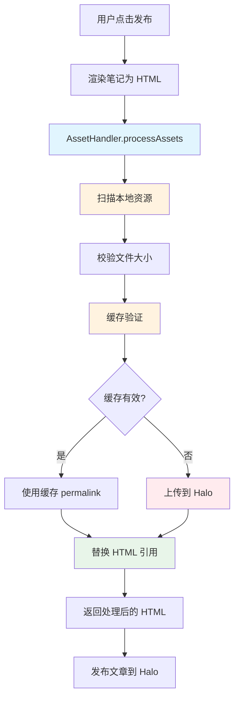
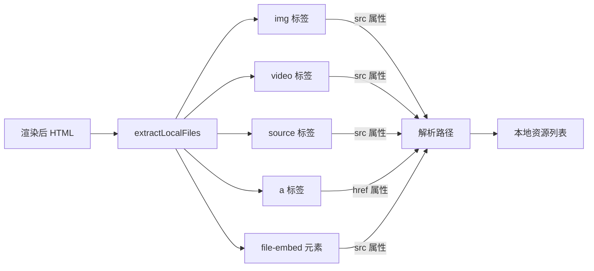
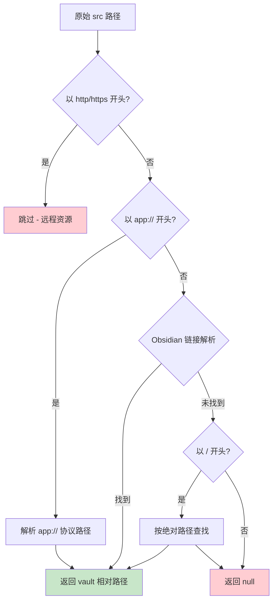
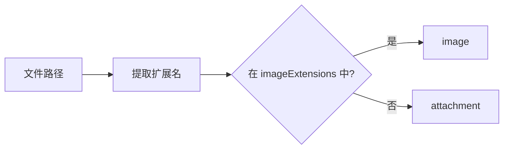
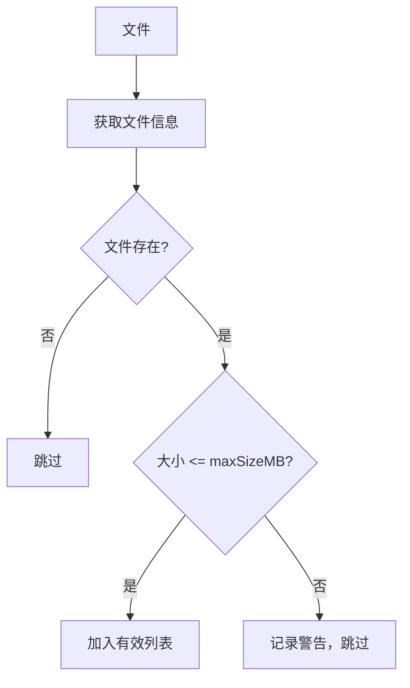
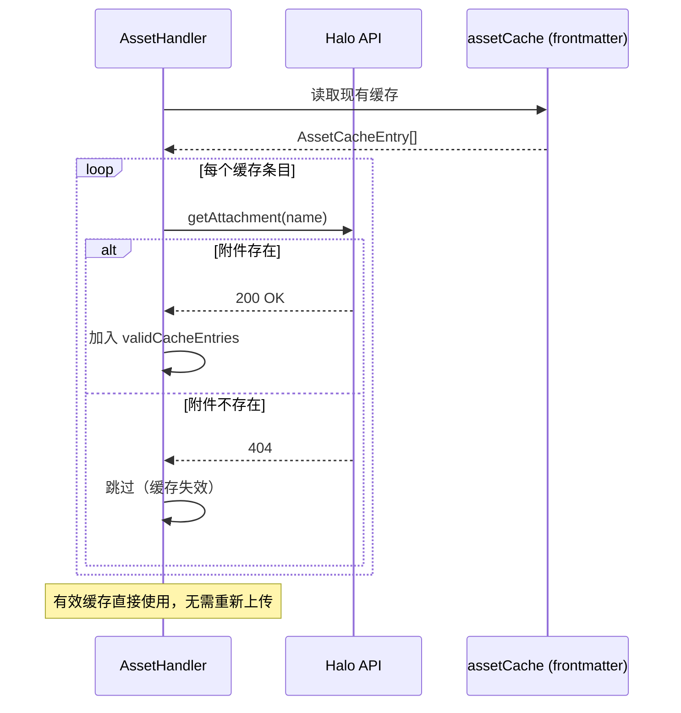
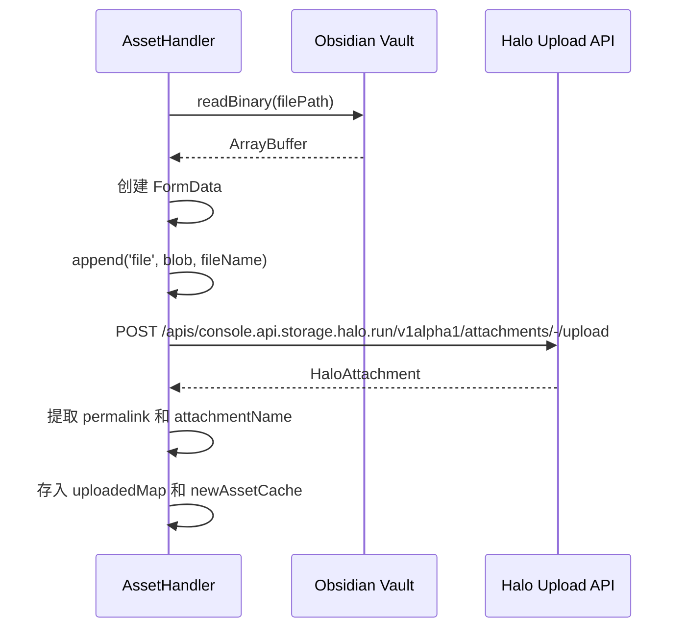
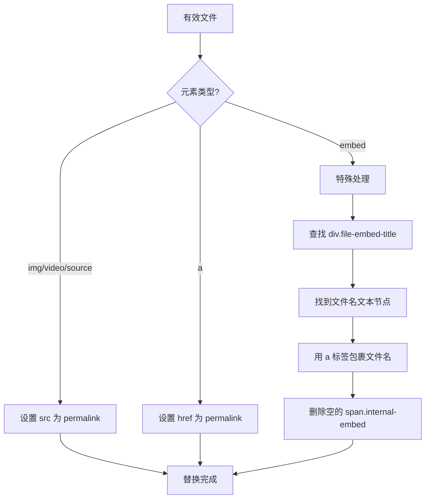
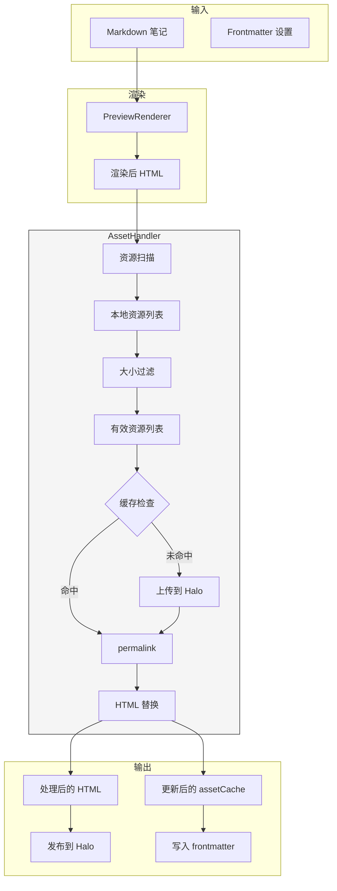

# 附件处理技术手册

## 概述

`AssetHandler` 负责将 Obsidian 笔记中引用的本地资源（图片、视频、音频、文档等）上传到 Halo 博客，并将渲染后 HTML 中的本地路径替换为 Halo 的永久链接。

**核心源码：** `src/content/asset-handler.ts`

---

## 整体架构



---

## 处理流程详解

### 1. 资源扫描

从渲染后的 HTML 中扫描所有本地资源引用，按元素类型分类：



**元素类型说明：**

| 类型 | HTML 元素 | 典型场景 |
|------|-----------|----------|
| `img` | `` | `![[image.png]]` |
| `video` | `<video src="...">` | `![[video.mp4]]` |
| `source` | `<source src="...">` | `<video>` 内的备用源 |
| `a` | `<a href="...">` | `[文件](./file.pdf)` |
| `embed` | `<span class="internal-embed file-embed" src="...">` | `![[file.exe]]` |

### 2. 路径解析

将 HTML 中的原始路径（`originalSrc`）解析为 Vault 内的相对路径：



**app:// 协议路径示例：**
```
app://ed57bb6f707b970d7cb342167cfe448b73b7/D:/Data/Notes/vault/image.png?1779936055537
                ↓ 解析为
image.png（vault 内相对路径）
```

### 3. 图片分类

根据文件扩展名判断是否为图片：



**默认图片扩展名：** `png, jpg, jpeg, gif, webp, svg, bmp`

可在设置中自定义，用逗号分隔。

### 4. 文件大小校验



**默认限制：** 100MB（可在设置中调整）

### 5. 缓存机制



**缓存数据结构（frontmatter）：**
```yaml
halo:
  assets:
    - localPath: "images/photo.png"
      permalink: "/upload/photo.png"
      attachmentName: "attachment-xxxx"
      assetType: "image"
    - localPath: "docs/file.pdf"
      permalink: "/upload/file.pdf"
      attachmentName: "attachment-yyyy"
      assetType: "attachment"
```

### 6. 上传流程



**处理模式：**

| 模式 | 图片 | 其他附件 |
|------|------|----------|
| `upload` | 上传到 Halo | 上传到 Halo |
| `base64` | 转为 Base64 嵌入 HTML | 不支持（记录警告） |

### 7. HTML 替换

替换策略因元素类型不同而异：



**embed 类型的 HTML 结构（替换前）：**

```html
<p>
  <span alt="file.exe" src="file.exe"
        class="internal-embed file-embed mod-generic is-loaded">
  </span>
</p>
<div class="file-embed-title">
  <span class="file-embed-icon"><svg>...</svg></span>
  file.exe
</div>
```

**embed 类型的 HTML 结构（替换后）：**

```html
<p></p>
<div class="file-embed-title">
  <span class="file-embed-icon"><svg>...</svg></span>
  <a href="/upload/file.exe" target="_blank" download="file.exe">file.exe</a>
</div>
```

> **为什么用字符串替换 embed 类型？**
>
> `DOMParser` 会将块级元素 `<div>` 从行内元素 `<span>` 中分离为兄弟节点，
> 导致原始的嵌套结构被破坏。因此 embed 类型的替换在 DOM 层面操作
> `file-embed-title` 中的文本节点，而非尝试替换 `<span>` 元素本身。

---

## 数据流总览



---

## 关键设计决策

### 为什么保存 `originalSrc`？

HTML 中的 `src`/`href` 属性是原始路径（如 `./image.png` 或 `app://...`），
而解析后的是 Vault 相对路径（如 `folder/image.png`）。替换时需要用原始路径
匹配 HTML 元素，因此必须同时保存两者。

### 为什么 embed 类型单独处理？

Obsidian 的文件嵌入使用 `<span class="internal-embed file-embed">` 结构，
但 `DOMParser` 会将 `<div>` 子元素从 `<span>` 中分离为兄弟节点。
直接操作 DOM 无法正确处理这种结构，因此改为操作 `file-embed-title`
中的文本节点。

### 缓存验证为什么需要远程调用？

附件可能在 Halo 后台被删除，本地缓存中的 `permalink` 会失效。
通过调用 `getAttachment` API 验证附件是否仍然存在，确保缓存的可靠性。

---

## 设置项

| 设置 | 路径 | 默认值 | 说明 |
|------|------|--------|------|
| 图片扩展名 | `imageHandling.imageExtensions` | `png,jpg,jpeg,gif,webp,svg,bmp` | 视为图片的扩展名列表 |
| 附件大小限制 | `attachmentHandling.maxSizeMB` | `100` | 单个附件最大 MB |
| 图片处理模式 | `imageHandling.defaultMode` | `upload` | `upload` 或 `base64` |
| Base64 质量 | `imageHandling.base64Quality` | `80` | Base64 压缩质量 (0-100) |
